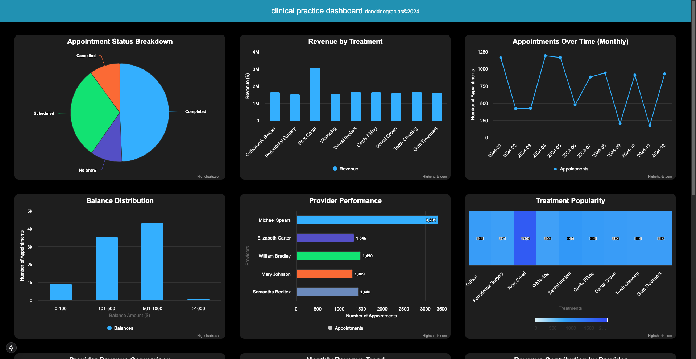

# Clinical Practice Dashboard

This project is a clinical practice dashboard that visualizes various aspects of a healthcare dataset, such as appointment statuses, provider performance, revenue trends, and more. The dashboard is built using **Next.js** and **Highcharts** for a dynamic and interactive user experience.



---

## Features and Charts

### 1. **Appointment Status Breakdown**
   - **Chart Type**: Pie Chart
   - Displays the distribution of appointments based on their status (e.g., Completed, Scheduled, Cancelled, No Show).

### 2. **Revenue by Treatment**
   - **Chart Type**: Column Chart
   - Visualizes the total revenue generated by each type of treatment.

### 3. **Appointments Over Time**
   - **Chart Type**: Line Chart
   - Shows the number of appointments booked over time, categorized monthly.

### 4. **Balance Distribution**
   - **Chart Type**: Column Chart
   - Represents the distribution of balances owed by patients, segmented into ranges (e.g., $0–$100, $101–$500).

### 5. **Provider Performance**
   - **Chart Type**: Bar Chart
   - Highlights the number of appointments handled by each provider.

### 6. **Treatment Popularity**
   - **Chart Type**: Heatmap
   - Illustrates the frequency of each treatment, indicating its popularity.

### 7. **Provider Revenue Comparison**
   - **Chart Type**: Stacked Bar Chart
   - Compares the revenue generated by each provider, broken down by treatment types.

### 8. **Monthly Revenue Trend**
   - **Chart Type**: Area Chart
   - Displays the revenue trends over the months, highlighting peaks and troughs.

### 9. **Revenue Contribution by Provider**
   - **Chart Type**: Donut Chart
   - Shows the percentage contribution of each provider to the total revenue.

### 10. **Appointment Trends by Provider**
   - **Chart Type**: Line Chart
   - Tracks the number of appointments handled by each provider over time.

### 11. **Treatment Success Rates by Provider**
   - **Chart Type**: Stacked Column Chart
   - Visualizes the success and failure rates of treatments performed by each provider.

### 12. **Patient Retention Rates**
   - **Chart Type**: Bar Chart
   - Analyzes patient retention, showing the ratio of single-visit to repeat-visit patients.


## Getting Started

First, run the development server:

```bash
npm run dev
# or
yarn dev
# or
pnpm dev
# or
bun dev
```

Open [http://localhost:3000](http://localhost:3000) with your browser to see the result.

You can start editing the page by modifying `app/page.tsx`. The page auto-updates as you edit the file.